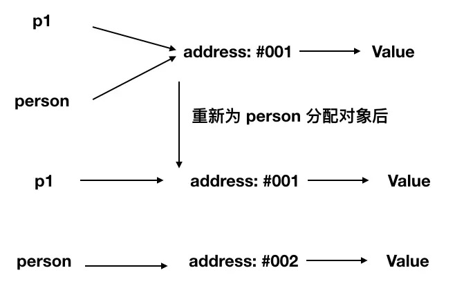

总共7种内置类型：6种基本数据类型和对象类型 
### 原始（Primitive）类型 
6种基本类型：
- number
- string
- null
- undefined
- boolean
- symbol
```javascript
typeof NaN // 'number'
NaN === NaN // false
typeof null // object
```
### 对象（Object）类型
  在 JS 中，除了原始类型那么其他的都是对象类型了。对象类型和原始类型不同的是，原始类型存储的是值，对象类型存储的是地址（指针）。当你创建了一个对象类型的时候，计算机会在内存中帮我们开辟一个空间来存放值，但是我们需要找到这个空间，这个空间会拥有一个地址（指针）。  
    
  对象的引用类型，在运用中会涉及到深拷贝和浅拷贝的问题
```javascript
let obj = {
  a: 1
}
let obj2 = obj
obj2.a = 2
obj.a // 2
```
```javascript
function test(person) {
  person.age = 18
  person = {
    name: 'yyy',
    age: 30
  }
  return person
}
const p1 = {
  name: 'jimmie',
  age: 25
}
const p2 = test(p1)
console.log(p1) 
//{name: "jimmie", age: 18}
console.log(p2)
//{name: "yyy", age: 30}
```
对于以上代码，你是否能正确的写出结果呢？接下来让我为你解析一番：  

首先，函数传参是传递对象指针的副本  
到函数内部修改参数的属性这步，我相信大家都知道，当前 p1 的值也被修改了  
但是当我们重新为 person 分配了一个对象时就出现了分歧，请看下图  

  
所以最后 person 拥有了一个新的地址（指针），也就和 p1 没有任何关系了，导致了最终两个变量的值是不相同的。