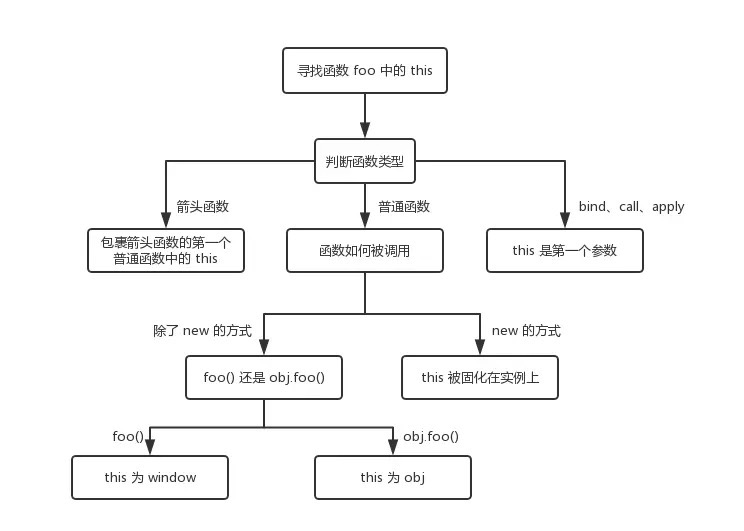

this 是很多人会混淆的概念，但是其实它一点都不难，只是网上很多文章把简单的东西说复杂了。在这一小节中，你一定会彻底明白 this 这个概念的。

```javascript
function foo() {
  console.log(this.a)
}
var a = 1
foo() // -> window  1

const obj = {
  a: 2,
  foo: foo
}
obj.foo() // -> obj  2

const c = new foo() // -> c
```

接下来我们一个个分析上面几个场景:

- 对于直接调用 foo 来说，不管 foo 函数被放在了什么地方，this 一定是 window
- 对于 obj.foo() 来说，我们只需要记住，谁调用了函数，谁就是 this，所以在这个场景下 foo 函数中的 this 就是 obj 对象
- 对于 new 的方式来说，this 被永远绑定在了 c 上面，不会被任何方式改变 this

说完了以上几种情况，其实很多代码中的 this 应该就没什么问题了，下面让我们看看箭头函数中的 this

```javascript
function a() {
  return () => {
    return () => {
      console.log(this)
    }
  }
}
console.log(a()()())
```

首先箭头函数其实是没有 this 的，箭头函数中的 this 只取决包裹箭头函数的第一个普通函数的 this。在这个例子中，因为包裹箭头函数的第一个普通函数是 a，所以此时的 this 是 window。另外对箭头函数使用 bind 这类函数是无效的。

最后种情况也就是 bind 这些改变上下文的 API 了，对于这些函数来说，this 取决于第一个参数，如果第一个参数为空，那么就是 window。

那么说到 bind，不知道大家是否考虑过，如果对一个函数进行多次 bind，那么上下文会是什么呢？

```javascript
let a = {}
let fn = function () { console.log(this) }
fn.bind().bind(a)() // => window
```

可以从上述代码中发现，不管我们给函数 bind 几次，fn 中的 this 永远由第一次 bind 决定，所以结果永远是 window。

下面用一张图来概括千言万语吧

 