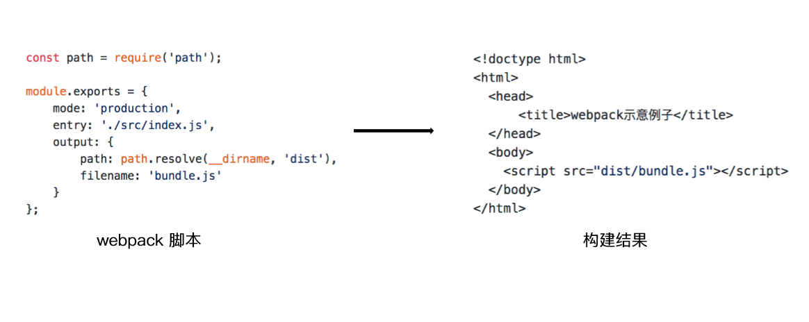
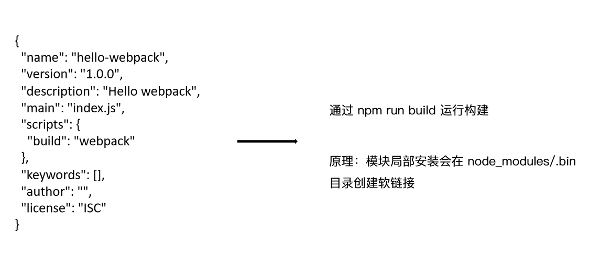

<!--
 * @Author: your name
 * @Date: 2019-11-29 15:00:04
 * @LastEditTime: 2019-11-29 16:21:16
 * @LastEditors: Please set LastEditors
 * @Description: In User Settings Edit
 * @FilePath: \interview\6、webpack\chapter1\README.md
 -->

## 基础篇：webpack 与构建发展简史

### 为什么需要构建工具？

- 转换ES6语法
- 转换JSX
- CSS前缀补全/预处理器
- 压缩混淆
- ES6 module 
- 主流浏览器支持情况图片压缩

### 为什么选择 webpack?

- 社区生态丰富
- 配置灵活和插件化扩展
- 官⽅更新迭代速度快

### 初识 webpack：配置⽂件名称

- webpack默认配置⽂件：webpack.config.js
- 可以通过 webpack --config 指定配置文件

### 初识 webpack：webpack 配置组成

```javascript
module.exports = {
  // 打包的⼊入⼝口⽂文件
  entry: "./src/index.js",
  // 打包的输出
  output: "./dist/main.js",
  // 环境
  mode: "production",
  // Loader 配置
  module: {
    rules: [{ test: /\.txt$/, use: "raw-loader" }]
  },
  // 插件配置
  plugins: [
    new HtmlwebpackPlugin({
      template: "./src/index.html"
    })
  ]
};
```

### 环境搭建：安装 Node.js 和 NPM

- 安装 nvm（https://github.com/nvm-sh/nvm）
  - 通过 curl 安装：curl -o- https://raw.githubusercontent.com/nvm-sh/nvm/v0.34.0/install.sh | bash
  - 通过 wget 安装：wget -qO- https://raw.githubusercontent.com/nvm-sh/nvm/v0.34.0/install.sh | bash
- 安装 Node.js 和 NPM
  - nvm install v10.15.3
  - 检查是否安装成功：node -v, npm -v

### 环境搭建：安装 webpack 和 webpack-cli

创建空⽬目录和 package.json

- mkdir my-project
- cd my-project
- npm init -y

安装 webpack 和 webpack-cli

- npm install webpack webpack-cli --save-dev
- 检查是否安装成功：./node_modules/.bin/webpack -v

### Webpack 初体验：⼀个最简单的例子



### 通过 npm script 运行 webpack


