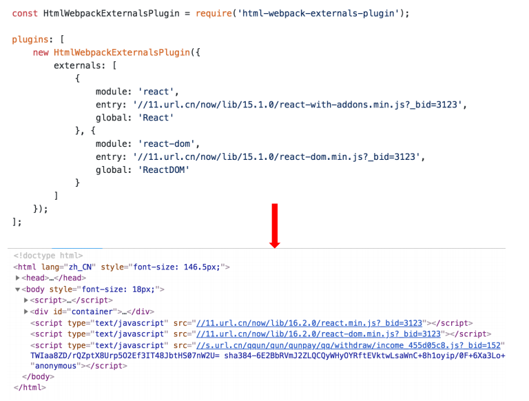
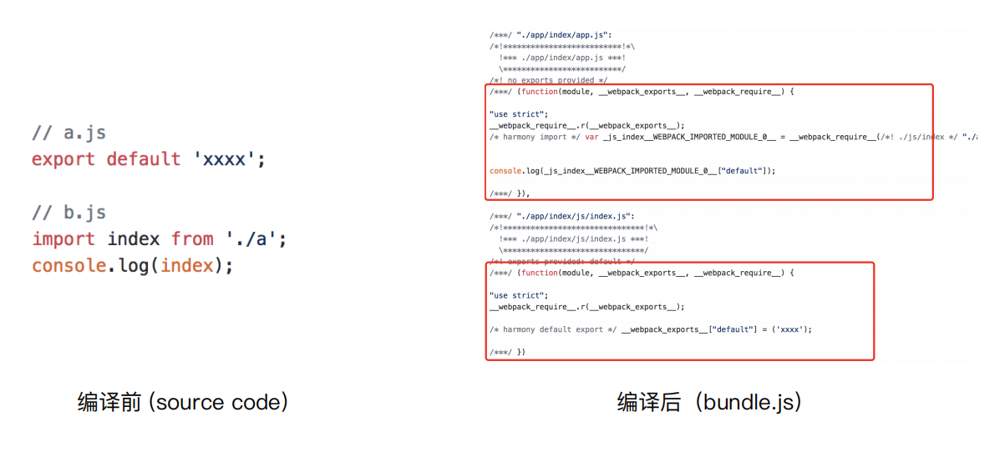
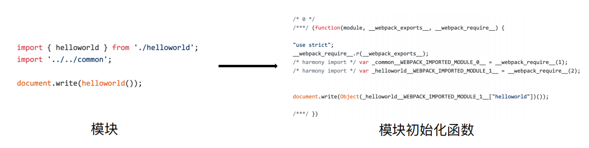
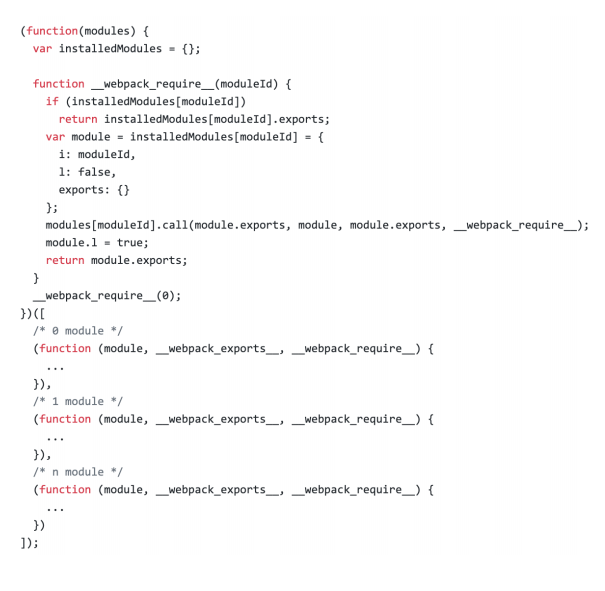
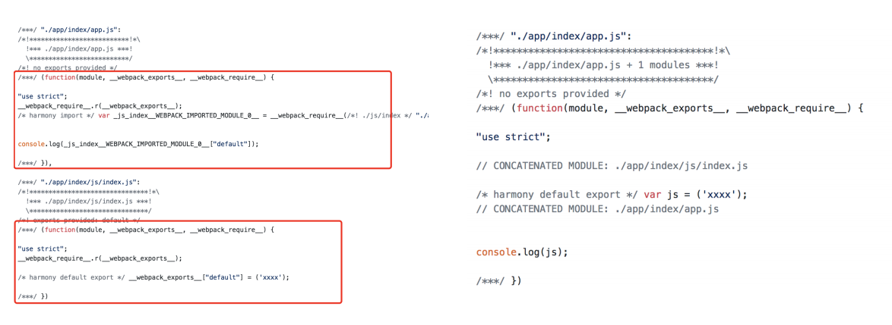
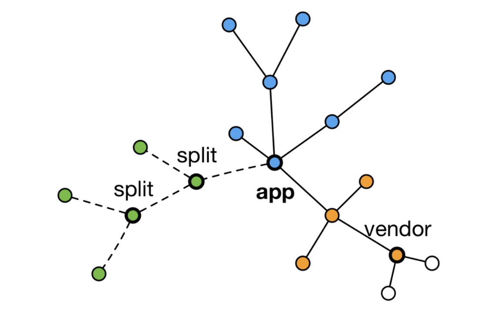
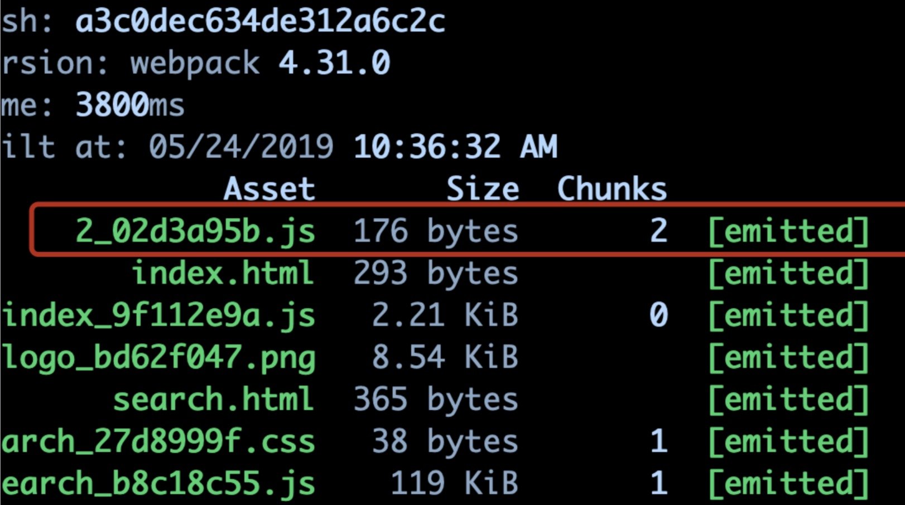

<!--
 * @Author: your name
 * @Date: 2019-11-29 16:24:03
 * @LastEditTime: 2019-12-02 09:33:33
 * @LastEditors: jimmiezhou
 * @Description: In User Settings Edit
 * @FilePath: \interview\6、webpack\chapter3\README.md
 -->

## 基础篇：webpack 进阶⽤法

### 当前构建时的问题

每次构建的时候不会清理⽬录，造成构建的输出⽬录 output ⽂件越来越多

### 通过 npm scripts 清理构建⽬录

rm -rf ./dist && webpack

rimraf ./dist && webpack

### ⾃动清理构建⽬录

避免构建前每次都需要⼿动删除 dist。使⽤ clean-webpack-plugin，默认会删除 output 指定的输出⽬录

```javascript
module.exports = {
  entry: {
    app: "./src/app.js",
    search: "./src/search.js"
  },
  output: {
    filename: "[name][chunkhash:8].js",
    path: __dirname + "/dist"
  },
+  plugins: [new CleanWebpackPlugin()]
};
```

### PostCSS 插件 autoprefixer ⾃动补⻬ CSS3 前缀

使⽤ autoprefixer 插件

```javascript
module.exports = {
  module: {
    rules: [
      {
        test: /\.less$/,
        use: [
          "style-loader",
          "css-loader",
          "less-loader",
+          {
+            loader: "postcss-loader",
+            options: {
+              plugins: () => [
+                require("autoprefixer")({
+                  browsers: ["last 2 version", "> 1%", "iOS 7"]
+                })
+              ]
+            }
+          }
        ]
      }
    ]
  }
};
```

### 浏览器的分辨率


### CSS 媒体查询实现响应式布局

缺陷：需要写多套适配样式代码

```css
@media screen and (max-width: 980px) {
  .header {
    width: 900px;
  }
}
@media screen and (max-width: 480px) {
  .header {
    height: 400px;
  }
}
@media screen and (max-width: 350px) {
  .header {
    height: 300px;
  }
}
```

### rem 是什么？

W3C 对 rem 的定义： font-size of the root element

rem 和 px 的对⽐：

- rem 是相对单位
- px 是绝对单位

### 移动端 CSS px ⾃动转换成 rem

使⽤ px2rem-loader

⻚⾯渲染时计算根元素的 font-size 值

- 可以使⽤⼿淘的 lib-flexible 库
- https://github.com/amfe/lib-flexible

```javascript
module.exports = {
  module: {
    rules: [
      {
        test: /\.less$/,
        use: [
          "style-loader",
          "css-loader",
          "less-loader",
+          {
+            loader: "px2rem-loader",
+            options: {
+              remUnit: 75,
+              remPrecision: 8
+            }
+          }
        ]
      }
    ]
  }
};
```

### 资源内联的意义

- 代码层⾯：
  - ⻚⾯框架的初始化脚本
  - 上报相关打点
  - css 内联避免⻚⾯闪动
- 请求层⾯：减少 HTTP ⽹络请求数
  - ⼩图⽚或者字体内联 (url-loader)

### HTML 和 JS 内联

- raw-loader 内联 html

```javascript
<script>${require(" raw-loader!babel-loader!. /meta.html")}</script>
```

- raw-loader 内联 JS

```javascript
<script>
  ${require("raw-loader!babel-loader!../node_modules/lib-flexible")}
</script>
```

### CSS 内联

- 借助 style-loader
- html-inline-css-webpack-plugin

```javascript
module.exports = {
  module: {
    rules: [
      {
        test: /\.scss$/,
        use: [
          {
            loader: "style-loader",
            options: {
              insertAt: "top", // 样式插入到 <head>
              singleton: true //将所有的style标签合并成一个
            }
          },
          "css-loader",
          "sass-loader"
        ]
      }
    ]
  }
};
```

### 多⻚⾯应⽤(MPA)概念

每⼀次⻚⾯跳转的时候，后台服务器都会给返回⼀个新的 html ⽂档，这种类型的⽹站也就是多⻚⽹站，也叫做多⻚应⽤。

### 多⻚⾯打包基本思路

每个⻚⾯对应⼀个 entry，⼀个 html-webpack-plugin

缺点：每次新增或删除⻚⾯需要改 webpack 配置

```javascript
module.exports = {
  entry: {
    index: "./src/index.js",
    search: "./src/search.js"
  }
};
```

### 多⻚⾯打包通⽤⽅案

动态获取 entry 和设置 html-webpack-plugin 数量

利⽤ glob.sync

entry: glob.sync(path.join(\_\_dirname, './src/\*/index.js')), };

```javascript
module.exports = {
  entry: {
    index: "./src/index/index.js",
    search: "./src/search/index.js"
  }
};
```

### 使⽤ source map

作⽤：通过 source map 定位到源代码

- source map 科普⽂：http://www.ruanyifeng.com/blog/2013/01/javascript_source_map.html

开发环境开启，线上环境关闭

- 线上排查问题的时候可以将 sourcemap 上传到错误监控系统

### source map 关键字

- eval: 使⽤ eval 包裹模块代码
- source map: 产⽣.map ⽂件
- cheap: 不包含列信息
- inline: 将.map 作为 DataURI 嵌⼊，不单独⽣成.map ⽂件
- module:包含 loader 的 sourcemap

### 基础库分离

思路：将 react、react-dom 基础包通过 cdn 引⼊，不打⼊ bundle 中

⽅法：使⽤ html-webpackexternals-plugin



### 利⽤ SplitChunksPlugin 进⾏公共脚本分离

Webpack4 内置的，替代 CommonsChunkPlugin 插件

chunks 参数说明：

- async 异步引⼊的库进⾏分离(默认)
- initial 同步引⼊的库进⾏分离
- all 所有引⼊的库进⾏分离(推荐)

```javascript
module.exports = {
  optimization: {
    splitChunks: {
      chunks: "async",
      minSize: 30000,
      maxSize: 0,
      minChunks: 1,
      maxAsyncRequests: 5,
      maxInitialRequests: 3,
      automaticNameDelimiter: "~",
      name: true,
      cacheGroups: {
        vendors: {
          test: /[\\/]node_modules[\\/]/,
          priority: -10
        }
      }
    }
  }
};
```

### 利⽤ SplitChunksPlugin 分离基础包

test: 匹配出需要分离的包

```javascript
module.exports = {
  optimization: {
    splitChunks: {
      cacheGroups: {
        commons: {
          test: /(react|react-dom)/,
          name: "vendors",
          chunks: "all"
        }
      }
    }
  }
};
```

### 利⽤ SplitChunksPlugin 分离⻚⾯公共⽂件

minChunks: 设置最⼩引⽤次数为 2 次

minuSize: 分离的包体积的⼤⼩

```javascript
module.exports = {
  optimization: {
    splitChunks: {
      minSize: 0,
      cacheGroups: {
        commons: {
          name: "commons",
          chunks: "all",
          minChunks: 2
        }
      }
    }
  }
};
```

### tree shaking(摇树优化)

概念：1 个模块可能有多个⽅法，只要其中的某个⽅法使⽤到了，则整个⽂件都会被打到 bundle ⾥⾯去，tree shaking 就是只把⽤到的⽅法打⼊ bundle ，没⽤到的⽅法会在 uglify 阶段被擦除掉

使⽤：webpack 默认⽀持，在 .babelrc ⾥设置 modules: false 即可

- production mode 的情况下默认开启

要求：必须是 ES6 的语法，CJS 的⽅式不⽀持

### DCE (Dead code elimination)

- 代码不会被执⾏，不可到达
- 代码执⾏的结果不会被⽤到
- 代码只会影响死变量（只写不读）

```javascript
if (false) {
  console.log("这段代码永远不会执行");
}
```

### Tree-shaking 原理

利⽤ ES6 模块的特点:

- 只能作为模块顶层的语句出现
- import 的模块名只能是字符串常量
- import binding 是 immutable 的

代码擦除： uglify 阶段删除⽆⽤代码

### 现象：构建后的代码存在⼤量闭包代码



### 会导致什么问题

⼤量作⽤域包裹代码，导致体积增⼤（模块越多越明显）。运⾏代码时创建的函数作⽤域变多，内存开销变⼤

### 模块转换分析



结论：

- 被 webpack 转换后的模块会带上⼀层包裹
- import 会被转换成 \_\_webpack_require

### 进⼀步分析 webpack 的模块机制



分析：

- 打包出来的是⼀个 IIFE (匿名闭包)
- modules 是⼀个数组，每⼀项是⼀个模块初始化函数
- \_\_webpack_require ⽤来加载模块，返回 module.exports
- 通过 WEBPACK_REQUIRE_METHOD(0) 启动程序

### scope hoisting 原理

- 原理：将所有模块的代码按照引⽤顺序放在⼀个函数作⽤域⾥，然后适当的重命名⼀
  些变量以防⽌变量名冲突
- 对比：通过 scope hoisting 可以减少函数声明代码和内存开销



### scope hoisting 使⽤

webpack mode 为 production 默认开启。必须是 ES6 语法，CJS 不⽀持

```javascript
module.exports = {
  entry: {
    app: "./src/app.js",
    search: "./src/search.js"
  },
  output: {
    filename: "[name][chunkhash:8].js",
    path: __dirname + "/dist"
  },
+  plugins: [new webpack.optimize.ModuleConcatenationPlugin()]
};
```

### 代码分割的意义

对于⼤大的 Web 应⽤用来讲，将所有的代码都放在⼀一个⽂文件中显然是不不够有效的，特别是当你的 某些代码块是在某些特殊的时候才会被使⽤用到。webpack 有⼀一个功能就是将你的代码库分割成 chunks(语块)，当代码运⾏行行到需要它们的时候再进⾏行行加载。

适⽤用的场景:

抽离相同代码到⼀一个共享块

脚本懒加载，使得初始下载的代码更更⼩小



### 懒加载 JS 脚本的⽅方式

CommonJS:require.ensure

ES6:动态 import(⽬目前还没有原⽣生⽀支持，需要 babel 转换)

### 如何使⽤用动态 import?

安装 babel 插件

npm install @babel/plugin-syntax-dynamic-import --save-dev

ES6:动态 import(⽬目前还没有原⽣生⽀支持，需要 babel 转换)

```javascript
{
"plugins": ["@babel/plugin-syntax-dynamic-import"],
... }
```

### 代码分割的效果



### ESLint 的必要性


### ⾏业⾥面优秀的 ESLint 规范实践

Airbnb: eslint-config-airbnb、 eslint-config-airbnb-base

### ESLint 如何执⾏行行落地?

和 CI/CD 系统集成 

和 webpack 集成

### ⽅案一:webpack 与 CI/CD 集成


