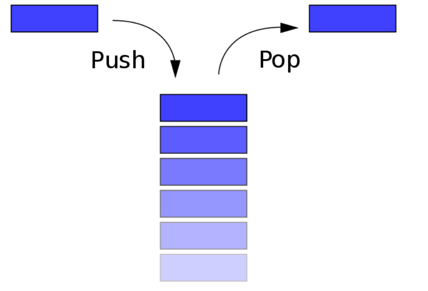

<!--
 * @Descripttion:
 * @version: 1.0.0
 * @Author: jimmiezhou
 * @Date: 2019-11-25 08:59:14
 * @LastEditors: Please set LastEditors
 * @LastEditTime: 2019-12-03 09:30:50
 -->

## 栈

### 概念

栈是一个线性结构，在计算机中是一个相当常见的数据结构。

栈的特点是只能在某一端添加或删除数据，遵循先进后出的原则。



### 实现

每种数据结构都可以用很多种方式来实现，其实可以把栈看成是数组的一个子集，所以这里使用数组来实现

```javascript
class Stack {
  constructor() {
    this.stack = [];
  }
  push(item) {
    this.stack.push(item);
  }
  pop() {
    this.stack.pop();
  }
  peek() {
    return this.stack[this.getCount() - 1];
  }
  getCount() {
    return this.stack.length;
  }
  isEmpty() {
    return this.getCount() === 0;
  }
}
```

### 应用

[选取了 LeetCode 上序号为 20 的题目](https://leetcode.com/problems/valid-parentheses/submissions/1)

题意是匹配括号，可以通过栈的特性来完成这道题目

```javascript
var isValid = function(s) {
  let map = {
    "(": -1,
    ")": 1,
    "[": -2,
    "]": 2,
    "{": -3,
    "}": 3
  };
  let stack = [];
  for (let i = 0; i < s.length; i++) {
    if (map[s[i]] < 0) {
      stack.push(s[i]);
    } else {
      let last = stack.pop();
      if (map[last] + map[s[i]] != 0) return false;
    }
  }
  if (stack.length > 0) return false;
  return true;
};
```


