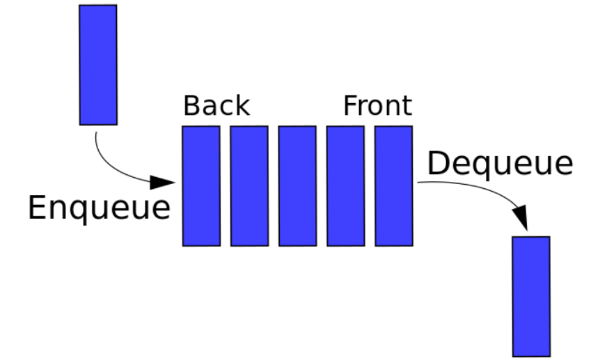

<!--
 * @Author: your name
 * @Date: 2019-12-03 09:30:36
 * @LastEditTime: 2019-12-03 10:17:58
 * @LastEditors: Please set LastEditors
 * @Description: In User Settings Edit
 * @FilePath: \9、数据结构\队列\README.md
 -->

## 队列

### 概念

队列一个线性结构，特点是在某一端添加数据，在另一端删除数据，遵循先进先出的原则。



### 实现

这里会讲解两种实现队列的方式，分别是单链队列和循环队列。

#### 单链队列

```javascript
class Queue {
  constructor() {
    this.queue = [];
  }
  enQueue(item) {
    this.queue.push(item);
  }
  deQueue() {
    return this.queue.shift();
  }
  getHeader() {
    return this.queue[0];
  }
  getLength() {
    return this.queue.length;
  }
  isEmpty() {
    return this.getLength() === 0;
  }
}
```

因为单链队列在出队操作的时候需要 O(n) 的时间复杂度，所以引入了循环队列。循环队列的出队操作平均是 O(1) 的时间复杂度。

### 循环队列

```javascript
class SqQueue {
  constructor(length) {
    this.queue = new Array(length + 1);
    // 队头
    this.first = 0;
    // 队尾
    this.last = 0;
    // 当前队列大小
    this.size = 0;
  }
  enQueue(item) {
    // 判断队尾 + 1 是否为队头
    // 如果是就代表需要扩容数组
    // % this.queue.length 是为了防止数组越界
    if (this.first === (this.last + 1) % this.queue.length) {
      this.resize(this.getLength() * 2 + 1);
    }
    this.queue[this.last] = item;
    this.size++;
    this.last = (this.last + 1) % this.queue.length;
  }
  deQueue() {
    if (this.isEmpty()) {
      throw Error("Queue is empty");
    }
    let r = this.queue[this.first];
    this.queue[this.first] = null;
    this.first = (this.first + 1) % this.queue.length;
    this.size--;
    // 判断当前队列大小是否过小
    // 为了保证不浪费空间，在队列空间等于总长度四分之一时
    // 且不为 2 时缩小总长度为当前的一半
    if (this.size === this.getLength() / 4 && this.getLength() / 2 !== 0) {
      this.resize(this.getLength() / 2);
    }
    return r;
  }
  getHeader() {
    if (this.isEmpty()) {
      throw Error("Queue is empty");
    }
    return this.queue[this.first];
  }
  getLength() {
    return this.queue.length - 1;
  }
  isEmpty() {
    return this.first === this.last;
  }
  resize(length) {
    let q = new Array(length);
    for (let i = 0; i < length; i++) {
      q[i] = this.queue[(i + this.first) % this.queue.length];
    }
    this.queue = q;
    this.first = 0;
    this.last = this.size;
  }
}
```
