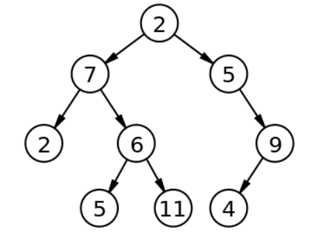
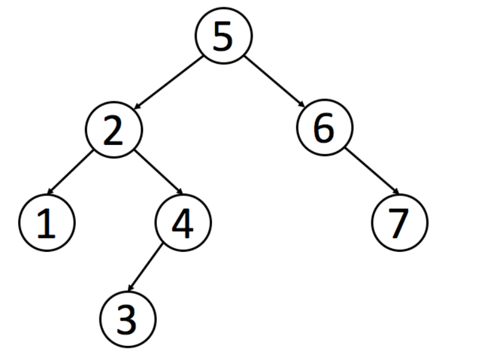

<!--
 * @Author: your name
 * @Date: 2019-12-03 10:18:45
 * @LastEditTime: 2019-12-03 10:29:55
 * @LastEditors: Please set LastEditors
 * @Description: In User Settings Edit
 * @FilePath: \9、数据结构\树\README.md
 -->

## 树

### 二叉树

树拥有很多种结构，二叉树是树中最常用的结构，同时也是一个天然的递归结构。

二叉树拥有一个根节点，每个节点至多拥有两个子节点，分别为：左节点和右节点。树的最底部节点称之为叶节点，当一颗树的叶数量数量为满时，该树可以称之为满二叉树。



### 二分搜索树

二分搜索树也是二叉树，拥有二叉树的特性。但是区别在于二分搜索树每个节点的值都比他的左子树的值大，比右子树的值小。

这种存储方式很适合于数据搜索。如下图所示，当需要查找 6 的时候，因为需要查找的值比根节点的值大，所以只需要在根节点的右子树上寻找，大大提高了搜索效率。



### 实现

```javascript
class Node {
  constructor(value) {
    this.value = value;
    this.left = null;
    this.right = null;
  }
}
class BST {
  constructor() {
    this.root = null;
    this.size = 0;
  }
  getSize() {
    return this.size;
  }
  isEmpty() {
    return this.size === 0;
  }
  addNode(v) {
    this.root = this._addChild(this.root, v);
  }
  // 添加节点时，需要比较添加的节点值和当前
  // 节点值的大小
  _addChild(node, v) {
    if (!node) {
      this.size++;
      return new Node(v);
    }
    if (node.value > v) {
      node.left = this._addChild(node.left, v);
    } else if (node.value < v) {
      node.right = this._addChild(node.right, v);
    }
    return node;
  }
}
```

以上是最基本的二分搜索树实现，接下来实现树的遍历。

对于树的遍历来说，有三种遍历方法，分别是先序遍历、中序遍历、后序遍历。三种遍历的区别在于何时访问节点。在遍历树的过程中，每个节点都会遍历三次，分别是遍历到自己，遍历左子树和遍历右子树。如果需要实现先序遍历，那么只需要第一次遍历到节点时进行操作即可。

以下都是递归实现

```javascript
// 先序遍历可用于打印树的结构
// 先序遍历先访问根节点，然后访问左节点，最后访问右节点。
preTraversal() {
  this._pre(this.root)
}
_pre(node) {
  if (node) {
    console.log(node.value)
    this._pre(node.left)
    this._pre(node.right)
  }
}
// 中序遍历可用于排序
// 对于 BST 来说，中序遍历可以实现一次遍历就
// 得到有序的值
// 中序遍历表示先访问左节点，然后访问根节点，最后访问右节点。
midTraversal() {
  this._mid(this.root)
}
_mid(node) {
  if (node) {
    this._mid(node.left)
    console.log(node.value)
    this._mid(node.right)
  }
}
// 后序遍历可用于先操作子节点
// 再操作父节点的场景
// 后序遍历表示先访问左节点，然后访问右节点，最后访问根节点。
backTraversal() {
  this._back(this.root)
}
_back(node) {
  if (node) {
    this._back(node.left)
    this._back(node.right)
    console.log(node.value)
  }
}
```

以上的这几种遍历都可以称之为深度遍历，对应的还有种遍历叫做广度遍历，也就是一层层地遍历树。对于广度遍历来说，我们需要利用之前讲过的队列结构来完成。

```javascript
breadthTraversal() {
  if (!this.root) return null
  let q = new Queue()
  // 将根节点入队
  q.enQueue(this.root)
  // 循环判断队列是否为空，为空
  // 代表树遍历完毕
  while (!q.isEmpty()) {
    // 将队首出队，判断是否有左右子树
    // 有的话，就先左后右入队
    let n = q.deQueue()
    console.log(n.value)
    if (n.left) q.enQueue(n.left)
    if (n.right) q.enQueue(n.right)
  }
}
```

接下来先介绍如何在树中寻找最小值或最大数。因为二分搜索树的特性，所以最小值一定在根节点的最左边，最大值相反

```javascript
getMin() {
  return this._getMin(this.root).value
}
_getMin(node) {
  if (!node.left) return node
  return this._getMin(node.left)
}
getMax() {
  return this._getMax(this.root).value
}
_getMax(node) {
  if (!node.right) return node
  return this._getMin(node.right)
}
```

向上取整和向下取整，这两个操作是相反的，所以代码也是类似的，这里只介绍如何向下取整。既然是向下取整，那么根据二分搜索树的特性，值一定在根节点的左侧。只需要一直遍历左子树直到当前节点的值不再大于等于需要的值，然后判断节点是否还拥有右子树。如果有的话，继续上面的递归判断。

```javascript
floor(v) {
  let node = this._floor(this.root, v)
  return node ? node.value : null
}
_floor(node, v) {
  if (!node) return null
  if (node.value === v) return v
  // 如果当前节点值还比需要的值大，就继续递归
  if (node.value > v) {
    return this._floor(node.left, v)
  }
  // 判断当前节点是否拥有右子树
  let right = this._floor(node.right, v)
  if (right) return right
  return node
}
```

排名，这是用于获取给定值的排名或者排名第几的节点的值，这两个操作也是相反的，所以这个只介绍如何获取排名第几的节点的值。对于这个操作而言，我们需要略微的改造点代码，让每个节点拥有一个 size 属性。该属性表示该节点下有多少子节点（包含自身）。

```javascript
class Node {
  constructor(value) {
    this.value = value
    this.left = null
    this.right = null
    // 修改代码
    this.size = 1
  }
}
// 新增代码
_getSize(node) {
  return node ? node.size : 0
}
_addChild(node, v) {
  if (!node) {
    return new Node(v)
  }
  if (node.value > v) {
    // 修改代码
    node.size++
    node.left = this._addChild(node.left, v)
  } else if (node.value < v) {
    // 修改代码
    node.size++
    node.right = this._addChild(node.right, v)
  }
  return node
}
select(k) {
  let node = this._select(this.root, k)
  return node ? node.value : null
}
_select(node, k) {
  if (!node) return null
  // 先获取左子树下有几个节点
  let size = node.left ? node.left.size : 0
  // 判断 size 是否大于 k
  // 如果大于 k，代表所需要的节点在左节点
  if (size > k) return this._select(node.left, k)
  // 如果小于 k，代表所需要的节点在右节点
  // 注意这里需要重新计算 k，减去根节点除了右子树的节点数量
  if (size < k) return this._select(node.right, k - size - 1)
  return node
}
```

接下来讲解的是二分搜索树中最难实现的部分：删除节点。因为对于删除节点来说，会存在以下几种情况

- 需要删除的节点没有子树
- 需要删除的节点只有一条子树
- 需要删除的节点有左右两条树

对于前两种情况很好解决，但是第三种情况就有难度了，所以先来实现相对简单的操作：删除最小节点，对于删除最小节点来说，是不存在第三种情况的，删除最大节点操作是和删除最小节点相反的，所以这里也就不再赘述。

```javascript
delectMin() {
  this.root = this._delectMin(this.root)
  console.log(this.root)
}
_delectMin(node) {
  // 一直递归左子树
  // 如果左子树为空，就判断节点是否拥有右子树
  // 有右子树的话就把需要删除的节点替换为右子树
  if ((node != null) & !node.left) return node.right
  node.left = this._delectMin(node.left)
  // 最后需要重新维护下节点的 `size`
  node.size = this._getSize(node.left) + this._getSize(node.right) + 1
  return node
}
```

最后讲解的就是如何删除任意节点了。对于这个操作，T.Hibbard 在 1962 年提出了解决这个难题的办法，也就是如何解决第三种情况。

当遇到这种情况时，需要取出当前节点的后继节点（也就是当前节点右子树的最小节点）来替换需要删除的节点。然后将需要删除节点的左子树赋值给后继结点，右子树删除后继结点后赋值给他。

你如果对于这个解决办法有疑问的话，可以这样考虑。因为二分搜索树的特性，父节点一定比所有左子节点大，比所有右子节点小。那么当需要删除父节点时，势必需要拿出一个比父节点大的节点来替换父节点。这个节点肯定不存在于左子树，必然存在于右子树。然后又需要保持父节点都是比右子节点小的，那么就可以取出右子树中最小的那个节点来替换父节点。

```javascript
delect(v) {
  this.root = this._delect(this.root, v)
}
_delect(node, v) {
  if (!node) return null
  // 寻找的节点比当前节点小，去左子树找
  if (node.value < v) {
    node.right = this._delect(node.right, v)
  } else if (node.value > v) {
    // 寻找的节点比当前节点大，去右子树找
    node.left = this._delect(node.left, v)
  } else {
    // 进入这个条件说明已经找到节点
    // 先判断节点是否拥有拥有左右子树中的一个
    // 是的话，将子树返回出去，这里和 `_delectMin` 的操作一样
    if (!node.left) return node.right
    if (!node.right) return node.left
    // 进入这里，代表节点拥有左右子树
    // 先取出当前节点的后继结点，也就是取当前节点右子树的最小值
    let min = this._getMin(node.right)
    // 取出最小值后，删除最小值
    // 然后把删除节点后的子树赋值给最小值节点
    min.right = this._delectMin(node.right)
    // 左子树不动
    min.left = node.left
    node = min
  }
  // 维护 size
  node.size = this._getSize(node.left) + this._getSize(node.right) + 1
  return node
}
```

### AVL 树

#### 概念

二分搜索树实际在业务中是受到限制的，因为并不是严格的 O(logN)，在极端情况下会退化成链表，比如加入一组升序的数字就会造成这种情况。

AVL 树改进了二分搜索树，在 AVL 树中任意节点的左右子树的高度差都不大于 1，这样保证了时间复杂度是严格的 O(logN)。基于此，对 AVL 树增加或删除节点时可能需要旋转树来达到高度的平衡。

##### 实现

因为 AVL 树是改进了二分搜索树，所以部分代码是于二分搜索树重复的，对于重复内容不作再次解析。

对于 AVL 树来说，添加节点会有四种情况


对于左左情况来说，新增加的节点位于节点 2 的左侧，这时树已经不平衡，需要旋转。因为搜索树的特性，节点比左节点大，比右节点小，所以旋转以后也要实现这个特性。

旋转之前：new < 2 < C < 3 < B < 5 < A，右旋之后节点 3 为根节点，这时候需要将节点 3 的右节点加到节点 5 的左边，最后还需要更新节点的高度。

对于右右情况来说，相反于左左情况，所以不再赘述。

对于左右情况来说，新增加的节点位于节点 4 的右侧。对于这种情况，需要通过两次旋转来达到目的。

首先对节点的左节点左旋，这时树满足左左的情况，再对节点进行一次右旋就可以达到目的。

```javascript
class Node {
  constructor(value) {
    this.value = value;
    this.left = null;
    this.right = null;
    this.height = 1;
  }
}

class AVL {
  constructor() {
    this.root = null;
  }
  addNode(v) {
    this.root = this._addChild(this.root, v);
  }
  _addChild(node, v) {
    if (!node) {
      return new Node(v);
    }
    if (node.value > v) {
      node.left = this._addChild(node.left, v);
    } else if (node.value < v) {
      node.right = this._addChild(node.right, v);
    } else {
      node.value = v;
    }
    node.height =
      1 + Math.max(this._getHeight(node.left), this._getHeight(node.right));
    let factor = this._getBalanceFactor(node);
    // 当需要右旋时，根节点的左树一定比右树高度高
    if (factor > 1 && this._getBalanceFactor(node.left) >= 0) {
      return this._rightRotate(node);
    }
    // 当需要左旋时，根节点的左树一定比右树高度矮
    if (factor < -1 && this._getBalanceFactor(node.right) <= 0) {
      return this._leftRotate(node);
    }
    // 左右情况
    // 节点的左树比右树高，且节点的左树的右树比节点的左树的左树高
    if (factor > 1 && this._getBalanceFactor(node.left) < 0) {
      node.left = this._leftRotate(node.left);
      return this._rightRotate(node);
    }
    // 右左情况
    // 节点的左树比右树矮，且节点的右树的右树比节点的右树的左树矮
    if (factor < -1 && this._getBalanceFactor(node.right) > 0) {
      node.right = this._rightRotate(node.right);
      return this._leftRotate(node);
    }

    return node;
  }
  _getHeight(node) {
    if (!node) return 0;
    return node.height;
  }
  _getBalanceFactor(node) {
    return this._getHeight(node.left) - this._getHeight(node.right);
  }
  // 节点右旋
  //           5                    2
  //         /   \                /   \
  //        2     6   ==>       1      5
  //       /  \               /       /  \
  //      1    3             new     3    6
  //     /
  //    new
  _rightRotate(node) {
    // 旋转后新根节点
    let newRoot = node.left;
    // 需要移动的节点
    let moveNode = newRoot.right;
    // 节点 2 的右节点改为节点 5
    newRoot.right = node;
    // 节点 5 左节点改为节点 3
    node.left = moveNode;
    // 更新树的高度
    node.height =
      1 + Math.max(this._getHeight(node.left), this._getHeight(node.right));
    newRoot.height =
      1 +
      Math.max(this._getHeight(newRoot.left), this._getHeight(newRoot.right));

    return newRoot;
  }
  // 节点左旋
  //           4                    6
  //         /   \                /   \
  //        2     6   ==>       4      7
  //             /  \         /   \      \
  //            5     7      2     5      new
  //                   \
  //                    new
  _leftRotate(node) {
    // 旋转后新根节点
    let newRoot = node.right;
    // 需要移动的节点
    let moveNode = newRoot.left;
    // 节点 6 的左节点改为节点 4
    newRoot.left = node;
    // 节点 4 右节点改为节点 5
    node.right = moveNode;
    // 更新树的高度
    node.height =
      1 + Math.max(this._getHeight(node.left), this._getHeight(node.right));
    newRoot.height =
      1 +
      Math.max(this._getHeight(newRoot.left), this._getHeight(newRoot.right));

    return newRoot;
  }
}
```