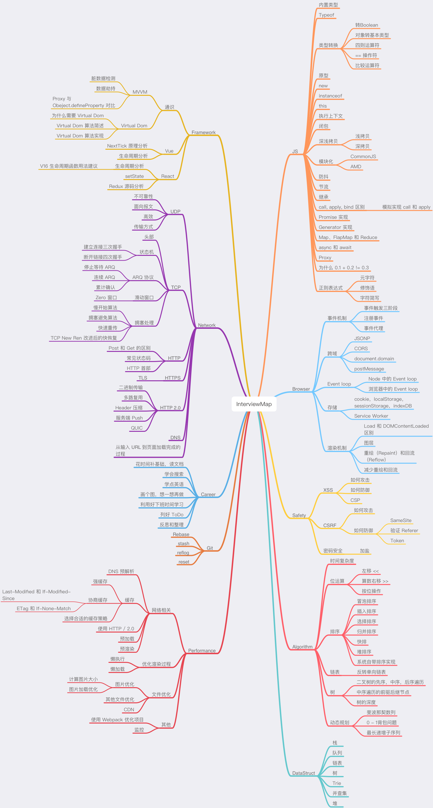

<!--
 * @Descripttion: 
 * @version: 1.0.0
 * @Author: jimmiezhou
 * @Date: 2019-11-21 14:24:18
 * @LastEditors: jimmiezhou
 * @LastEditTime: 2019-12-04 16:21:44
 -->
# interview
系统整理前端知识体系
 
 

## 面试好文

[中高级前端大厂面试秘籍，为你保驾护航金三银四，直通大厂(上)](https://juejin.im/post/5c64d15d6fb9a049d37f9c20)

[(中篇)中高级前端大厂面试秘籍，寒冬中为您保驾护航，直通大厂](https://juejin.im/post/5c92f499f265da612647b754)

[(下篇)中高级前端大厂面试秘籍，寒冬中为您保驾护航，直通大厂](https://juejin.im/post/5cc26dfef265da037b611738#heading-16)

[2018春招前端面试: 闯关记(精排精校) | 掘金技术征文](https://juejin.im/post/5a998991f265da237f1dbdf9)

[jsliang 的 2019 面试准备](https://juejin.im/post/5c8e4cd3f265da67c87454a0)

[三年前端，面试思考（头条蚂蚁美团offer）](https://juejin.im/post/5bd97627f265da39651c0a4b)

[面试分享：2018阿里巴巴前端面试总结 | 掘金技术征文](https://juejin.im/post/5ab0da85f265da23866fb9b7)

[如何轻松拿到淘宝前端 offer | 掘金技术征文](https://juejin.im/post/5bbc54a2e51d450e5a7445b4)

[【周刊-2】三年大厂面试官-前端面试题（偏难）](https://juejin.im/post/5cb0315f518825215e61ec14)

[面试分享：两年工作经验成功面试阿里P6总结](https://juejin.im/post/5d690c726fb9a06b155dd40d)

[面试资源汇总](https://github.com/abc-club/free-resources/blob/master/INTERVIEW.md)

