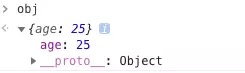
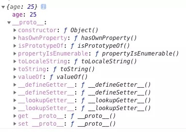
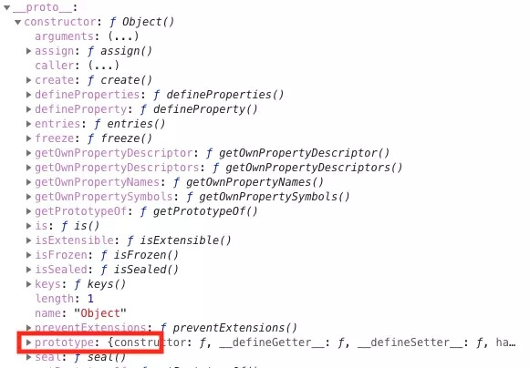

<!--
 * @Descripttion: 
 * @version: 1.0.0
 * @Author: jimmiezhou
 * @Date: 2019-11-21 15:45:02
 * @LastEditors: jimmiezhou
 * @LastEditTime: 2019-11-21 15:53:06
 -->
当我们创建一个对象时 let obj = { age: 25 }，我们可以发现能使用很多种函数，但是我们明明没有定义过它们，对于这种情况你是否有过疑惑？
  
  

当我们在浏览器中打印 obj 时你会发现，在 obj 上居然还有一个 __proto__ 属性，那么看来之前的疑问就和这个属性有关系了。

其实每个 JS 对象都有 __proto__ 属性，这个属性指向了原型。这个属性在现在来说已经不推荐直接去使用它了，这只是浏览器在早期为了让我们访问到内部属性 [[prototype]] 来实现的一个东西。

讲到这里好像还是没有弄明白什么是原型，接下来让我们再看看 __proto__ 里面有什么吧。

 

看到这里你应该明白了，原型也是一个对象，并且这个对象中包含了很多函数，所以我们可以得出一个结论：对于 obj 来说，可以通过 __proto__ 找到一个原型对象，在该对象中定义了很多函数让我们来使用。

在上面的图中我们还可以发现一个 constructor 属性，也就是构造函数

 

打开 constructor 属性我们又可以发现其中还有一个 prototype 属性，并且这个属性对应的值和先前我们在 __proto__ 中看到的一模一样。所以我们又可以得出一个结论：原型的 constructor 属性指向构造函数，构造函数又通过 prototype 属性指回原型，但是并不是所有函数都具有这个属性，Function.prototype.bind() 就没有这个属性。

其实原型就是那么简单，接下来我们再来看一张图，相信这张图能让你彻底明白原型和原型链.

 

看完这张图，我再来解释下什么是原型链吧。其实原型链就是多个对象通过 __proto__ 的方式连接了起来。为什么 obj 可以访问到 valueOf 函数，就是因为 obj 通过原型链找到了 valueOf 函数。

对于这一小节的知识点，总结起来就是以下几点：
- Object 是所有对象的爸爸，所有对象都可以通过 __proto__ 找到它
- Function 是所有函数的爸爸，所有函数都可以通过 __proto__ 找到它
- 函数的 prototype 是一个对象
- 对象的 __proto__ 属性指向原型， __proto__ 将对象和原型连接起来组成了原型链